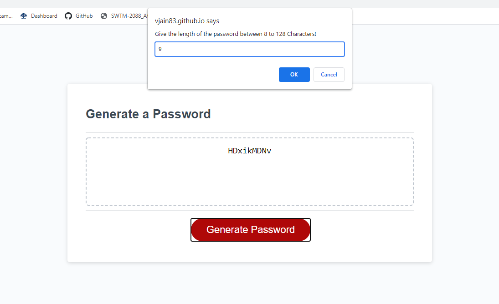

# Password Generator

This application can be used to generated a random password based on following criterion provided by the user:

- Password must be between 8 and 128 characters
- Password could contain Uppercase characters.
- Password could contain Lowercase characters.
- Password could contain Numbers.
- Password could contain Special characters.
- At least one type of characters set should be provided.

## Live URL

Live application is deployed at https://vjain83.github.io/password-generator/

## Applicaton Screenshot

